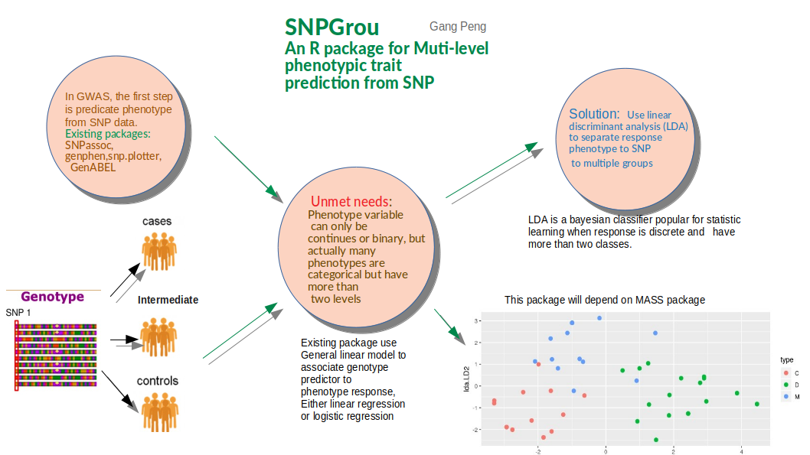
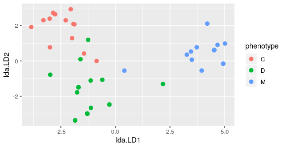
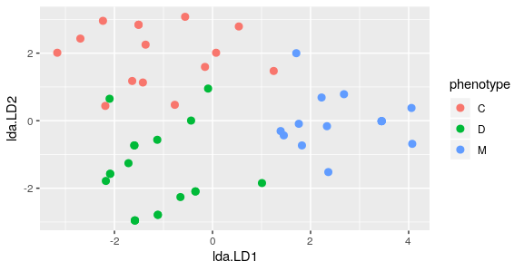
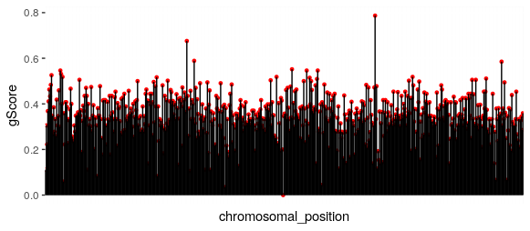

# SNPgrou

<!-- badges: start -->
<!-- badges: end -->

The goal of SNPgrou is to associate multi-level phenotypic traits with multiple loci to genome wide SNP data. 

## Installation

You can install the released version of SNPgrou by:

``` r
require("devtools")
install_github("Kevinpen/SNPgrou")
library("SNPgrou")
```

## Overview
An overview of the package is illustrated below. 

 


## Contributions

The author of the package is Gang Peng. The functions available within this package include:

``` r
library("SNPgrou")
lsf.str("package:SNPgrou")
```
- prep
- snpgrou
- gws
- groupView
- plotGws
- summaryGws
- is.gScore
- summarySNP
- is.SNP

The function prep() transform the data to class "SNP" object, with alleles separated by "/". The function snpgrou() input data prepared by prep function, use linear discriminant analysis to classify response phenotype according to genotype SNP, the response have more than two levels, genotype allow multi-allelic. The result of this function is a set of gScores for each locus, which is a metric for how strongly a locus is related to the phenotype. The function gws() accept input of genome wide SNP data and use snpgrou function to calculate and visualize the gScore of all loci.

In existing GWS packages, phenotype response variable are limited to continues or binary, this package specifically extends the response to categorical and have multiple levels. So this package can be used for situations where phenotype data are like eye colours or subtypes of breast cancer. 

This package use lda function from MASS package, but to give an explicit metric of how each locus is related to the phenotype, it build a "gScore", which is the measure of how accurately the lda model generate phenotype in repeated cross-validation. This practice is based on the idea that when using leave-one-out cross-validation to predicate the phenotype, those locus with strong relation to phenotype should be able to accurately predicate. This concept is similar to  "Classification accuracy" in the package "genephen", which use other statistical learning model.

The package use GWS data from package "SNPassoc", but the original phenotype data is binary, here three levels phenotype is simulated. 

Use groupview function on two toy sample data, can visually illustrate how well can the SNPs in multiple loci predicate phenotype. Use it on "geneSNP":

``` r
data(geneSNP)
groupView(geneSNP)
```
The output will be like this:

 

Clearly the phenotype is separated into three groups.

If you use it on data "geneSNP2":

``` r
data(geneSNP2)
groupView(geneSNP2)
```
The output will be like this:

 

The phenotype still separated into three groups but less clear. Both sets SNP data can predicate phenotype but how strong is the relation and which locus is most strongly related to phenotype? This question can be answered when you use snpgrou fucntion to look at the gScores:

```r
snpgrou(geneSNP,100)
# snp10001  snp10002  snp10003  snp10005  snp10008 
# 0.3321754 0.8362573 0.3398129 0.3350877 0.3305848 
snpgrou(geneSNP2,100)
# snp10001  snp10002  snp10003  snp10005  snp10008 
# 0.3341287 0.7122807 0.3427251 0.3293801 0.3306316
```
The result shows snp10002 has the highest gScore and geneSNP data has higher score compared to geneSNP2, consistent with the visualization.

The result of gws function using hapData, is the a computation of genome-wide gScores of every loci, return an object of class "gScore". The values of these gScores can be viewed by running summaryGws(gScores); if using plotGws(gScore) to plot the gScores, the result will be like: 

 

## Things to do
- Add associate function for phenotype to single biallelic locus association, adapt to dominant, recessive, multiplicative, additive and over-dominant inheritence models.
- A statistical analysis paper 

## Acknowledgement 
- Thanks package "genphen"(DOI: 10.18129/B9.bioc.genphen, Author: Simo Kitanovski) inspired the concept of gScore.  
- Thanks package "SNPassoc"(https://cran.r-project.org/web/packages/SNPassoc/index.html) authored by "Juan R González, Lluís Armengol, Elisabet Guinó, Xavier Solé, and Víctor Moreno" and "genABEL"(https://cran.r-project.org/src/contrib/Archive/GenABEL/) authored by "Lennart C. Karssen, Cornelia M. van Duijn and Yurii S. Aulchenko" for demonstrating common workflow of GWS.


