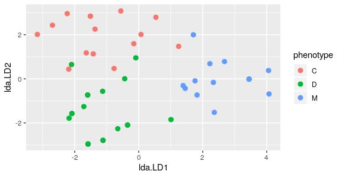

## Introduction

SNPgrou is intended to use as a tool to assist GWAS: asscociate phenotypic response to genotype data. In existing GWAS packages, phenotype response variable are limited to continues or binary, this package specifically extends the response to categorical and have multiple levels. So this package can be used for situations where phenotype data are like eye colours or subtypes of breast cancer. 

This package use lda function from MASS package, but to give an explicit metric of how each locus is related to the phenotype, it build a "gScore", which is the measure of how accurately the lda model generate phenotype in repeated cross-validation. This practice is based on the idea that when using leave-one-out cross-validation to predicate the phenotype, those locus with strong relation to phenotype should be able to accurately predicate phenotype. 

```{r setup}
library(SNPgrou)
```


## Prepare data

The function prep() transform the data to class "SNP" object, with alleles separated by "/".

```{r}
data(geneSNP)
# When column in data originally use delimiter "-", replaced by "/"
s1 <- prep(geneSNP$snp10001,delim="-") 

# When column in data originally use delimiter "," replaced by "/"
s2 <- prep(geneSNP$snp10002,delim=",")

# When column in original data use no delimiter, add "/"
s3 <- prep(geneSNP$snp10003)    

```

Return value of prep() is object belong to "SNP" and "factor", with attributes of alleleNames, the return value can be used for other functions such as snpgrou() as input. If user want to see result of prepared genotype data, function summarySNP can be used.

## groupView

Use groupview function on two toy sample data, can visually illustrate how well can the SNPs in multiple loci predicate phenotype. Use it on "geneSNP":

``` {r,eval = FALSE}
library(SNPgrou)
data(geneSNP)
groupView(geneSNP)
```


Clearly the phenotype is separated into three groups.

If you use it on data "geneSNP2":

``` {r, eval = FALSE}
data(geneSNP2)
groupView(geneSNP2)
```


The phenotype still separated into three groups but less clear. Both sets SNP data can predicate phenotype but how strong is the relation and which locus is most strongly related to phenotype? This question can be answered when you use snpgrou fucntion to look at the gScores.

## snpgrou() shows gScore

The function snpgrou() input data prepared by prep function, use linear discriminant analysis to classify response phenotype according to genotype SNP. The result of this function is a set of gScores for each locus, which is a metric for how strongly a locus is related to the phenotype.

```{r}
snpgrou(geneSNP,100)
snpgrou(geneSNP2,100)

```

The result shows snp10002 has the highest gScore and geneSNP data has higher score compared to geneSNP2, consistent with the visualization.


## Genowide study(GWAS) using gws(), summaryGws(), plotGws()
The function gws() accept input of genome wide SNP data and use snpgrou function to calculate the gScore of all loci. It return an object of class "gScore". Use plotGws(gScore) to plot the gScores.

```{r,eval=FALSE}
data(hapData)
gScore <- gws(hapData,5)
plotGws(gScore)

```


The values of these gScores can be viewed by running summaryGws(gScores):
```{r}
data(hapData)
gScore <- gws(hapData,5)
summaryGws(gScore)

```


## summarySNP() shows SNP data summary prepared by prep()

Summarize the frequency and percentage of genotypes and alleles in the SNP data:

```{r}
s3 <- prep(geneSNP$snp10003)
summarySNP(s3)

```

```{r, include = FALSE}
knitr::opts_chunk$set(
  collapse = TRUE,
  comment = "#>"
)
```

